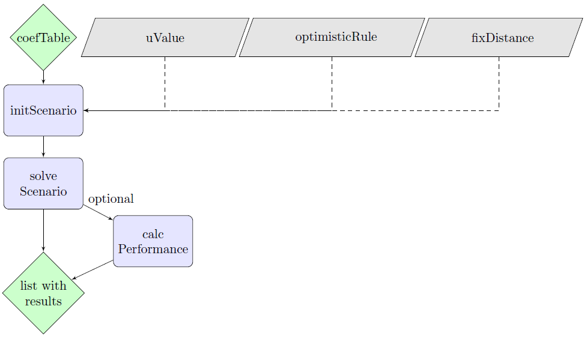

optimLanduse
-----------

<h3>
<a name="menu"></a>
</h3>
<ul>
<li>
<a href="#1. Einleitung">Introduction</a>
</li>
<li>
<a href="#3. Input und Output">Package structure</a>
</li>
<li>
<a href="#6. Beispielhafte Anwendung">Exemplary application</a>
</li>
<li>
<a href="#7. Literatur">Literature</a>
</li>
</ul>


<h3>
<a name="1. Einleitung">Introduction</a>
</h3>

**optimLanduse** provides methods for robust multi-criterial landscape optimization that explicitly account for uncertainty in the optimization of the land allocation to land-use options. High landscape diversity is assumed to increase the number and level of ecosystem services. However, the interactions between ecosystem service provision, disturbances and landscape composition are poorly understood. Knoke et al. (2016) therefore presented a novel approach to incorporate uncertainty in land allocation optimization to improve the provision of multiple ecosystem services. The optimization framework of Knoke et al. (2016) is implemented in the **optimLanduse** package, aiming to make it easily accessible for practical land-use optimization and to enable efficient batch applications.

The method is already established in land-use optimization and has been applied in a couple of studies. More details about the theory, the definition of the formal optimization problem and also significant examples are listed in the <a href="#7. Literatur">literature</a> section

We designed a graphical shiny application for the package to get a quick idea of the functionalities of the package, see https://gitlab.gwdg.de/forest_economics_goettingen/optimlanduse_shiny.


<h3>
<a name="3. Input und Output">Package structure</a>
</h3>

This chapter provides brief overview over the package functions. Please consider their respective help pages for more information. The function lpSolveAPI comes from the **lpSolveAPI** package. https://cran.r-project.org/package=lpSolveAPI

#### Input
- *Coefficients table* with indicotrs expectations and uncertainties. Best would be to consider the format as given in **exampleGosling_2020.xlsx**. See the help files of the **exampleData** and **initScenario** functions for more details.
- *Uncertainty value*. See the help file of the **iniScenario** function for more details.
- *The optimistic rule* indicates whether the optimistic outcomes of an indicator are directly reflected by their expectations or if the indicator is calculated as expectation + uncertainty when "more is better", expectation - uncertainty respectively when "less is better".
- *Fixing the distance* allows you to change the uncertainty level, without changing the uncertainty framework. For instance, you can then relate the achieved portfolio performance, with a low uncertainty level, to a wider and constant uncertainty framework within your analysis; so the betas remain comparable with each other over the course of the uncertainty analysis.

#### Output
An **optimLanduse** object containing informations of the optimization model and solution. It contains anongst others the
- land use allocation in the optimum,
- the detailed table with all possible indicator combinations (the scenario table), and the
- minimum distance **&beta;**.


<p align="center">
  
</p>

<h3>
<a name="6. Beispielhafte Anwendung">Exemplary application</a>
</h3>
Um die aktuellste stabile Version zu installieren, führen Sie den folgenden Code aus. 
tbd. Kann nach Migration zu github weg weg.

``` r
## Benötigte Pakete
# Tested with R Version 4.0.3.
packages <- c("devtools", "lpSolveAPI",
             "dplyr", "tidyr", "remotes",
             "readxl")

## Herunterladen und installieren oder aktivieren

package.check <- lapply(
  packages,
  FUN = function(x) {
    if (!require(x, character.only = TRUE)) {
      install.packages(x, dependencies = TRUE)
      library(x, character.only = TRUE)
    }
  }
)

install_gitlab("forest_economics_goettingen/optimlanduse", host = "gitlab.gwdg.de")

```

Simple example
``` r
require(readxl)
library(optimLanduse)

path <- exampleData("exampleGosling_2020.xlsx")
dat <- read_xlsx(path, col_names = FALSE)

dat <- dataPreparation(dat, uncertainty = "SE", expVAL = "score")

init <- initScenario(dat,
                     uValue = 2,
                     optimisticRule = "expectation",
                     fixDistance = NULL)
result <- solveScenario(x = init)
performance <- calcPerformance(result)


result$landUse
result$scenarioTable
result$scenarioSettings
result$status
result$beta
```

Exemplary batch application for distinct uncertainty values u
``` r
require(readxl)
library(optimLanduse)

path <- exampleData("exampleGosling_2020.xlsx")
dat <- read_xlsx(path, col_names = FALSE)

dat <- dataPreparation(dat, uncertainty = "SE", expVAL = "score")

# define sequence of uncertainties
u <- seq(1, 5, 1)

# prepare empty data frame for the results

## alternative 1: loop, simply implemented ##

loopDf <- data.frame(u = u, matrix(NA, nrow = length(u), ncol = 1 + length(unique(dat$landUse))))
names(loopDf) <- c("u", "beta", unique(dat$landUse))

for(i in u) {
  init <- initScenario(dat, uValue = i, optimisticRule = "expectation", fixDistance = NULL)
  result <- solveScenario(x = init)
  loopDf[loopDf$u == i,] <- c(i, result$beta, as.matrix(result$landUse))
}

# alternative 2: apply, faster
applyDf <- data.frame(u = u)

applyFun <- function(x) {
  init <- initScenario(dat, uValue = x, optimisticRule = "expectation", fixDistance = NULL)
  result <- solveScenario(x = init)
  return(c(result$beta, as.matrix(result$landUse)))
}

applyDf <- cbind(applyDf,
                 t(apply(applyDf, 1, applyFun)))
                 
names(applyDf) <- c("u", "beta", names(result$landUse))
```

Plot the land-use allocations with increasing uncertainty
``` r
# Typical result visualization
require(ggplot2)
require(dplyr)
require(tidyr)

applyDf %>% gather(key = "land-use option", value = "land-use share", -u, -beta) %>%
  ggplot(aes(y = `land-use share`, x = u, fill = `land-use option`)) +
  geom_area(alpha = .8, color = "white") + theme_minimal()
```


Batch example - parallel

``` r
library(optimLanduse)
require(readxl)
require(foreach)
require(doParallel)

path <- exampleData("exampleGosling_2020.xlsx")
dat <- read_xlsx(path, col_names = FALSE)

dat <- dataPreparation(dat, uncertainty = "SE", expVAL = "score")

registerDoParallel(8)

u <- seq(1, 5, 1)


loopDf1 <- foreach(i = u, .combine = rbind, .packages = "optimLanduse") %dopar% {
  init <- initScenario(dat, uValue = i, optimisticRule = "expectation", fixDistance = NULL)
  result <- solveScenario(x = init)
  c(i, result$beta, as.matrix(result$landUse))
}

stopImplicitCluster()
```

Batch application for distinct uncertainty values and fixed distance at the highest uncertainty level.

``` r
library(optimLanduse)
require(readxl)
require(dplyr)
require(tidyr)

path <- exampleData("exampleGosling_2020.xlsx")
dat <- read_xlsx(path, col_names = FALSE)

dat <- dataPreparation(dat, uncertainty = "SE", expVAL = "score")

# Sequenz definieren
u <- c(5:1) # Important: decreasing!


applyDf <- data.frame(u = u)
dist <- NULL
applyFun <- function(x) {
  init <- initScenario(dat, uValue = x, optimisticRule = "expectation",
                       fixDistance = dist)
  result <- optimLanduse::solveScenario(x = init)
  dist <<- result$distance
  return(c(result$beta,
           as.matrix(result$landUse)))
}

applyDf <- cbind(applyDf,
                 t(apply(applyDf, 1, applyFun))) %>% 
                 rename_at(vars(factor(1:(length(unique(dat$landUse))+1))),
                           ~ c("beta",unique(dat$landUse))) 
```

<h3>
<a name="7. Literatur">Literature</a>
</h3>

Gosling, E., Reith, E., Knoke T., Gerique, A., Paul, C. (2020): Exploring farmer perceptions of agroforestry via multi-objective optimisation: a test application in Eastern Panama. <em>Agroforestry Systems</em> **94(5)**. https://doi.org/10.1007/s10457-020-00519-0

Knoke, T., Paul, C., Hildebrandt, P. et al. (2016): Compositional diversity of rehabilitated tropical lands supports multiple ecosystem services and buffers uncertainties. <em>Nat Commun</EM> **7**, 11877. https://doi.org/10.1038/ncomms11877

Paul, C., Weber, M., Knoke, T. (2017): Agroforestry versus farm mosaic systems – Comparing land-use efficiency, economic returns and risks under climate change effects. <em>Sci. Total Environ.</em> **587-588**. https://doi.org/10.1016/j.scitotenv.2017.02.037.

Knoke, T., Paul, C., et al. (2020). Accounting for multiple ecosystem services in a simulation of land‐use decisions: Does it reduce tropical deforestation?. <em>Global change biology</em> **26(4)**. https://doi.org/10.1111/gcb.15003
